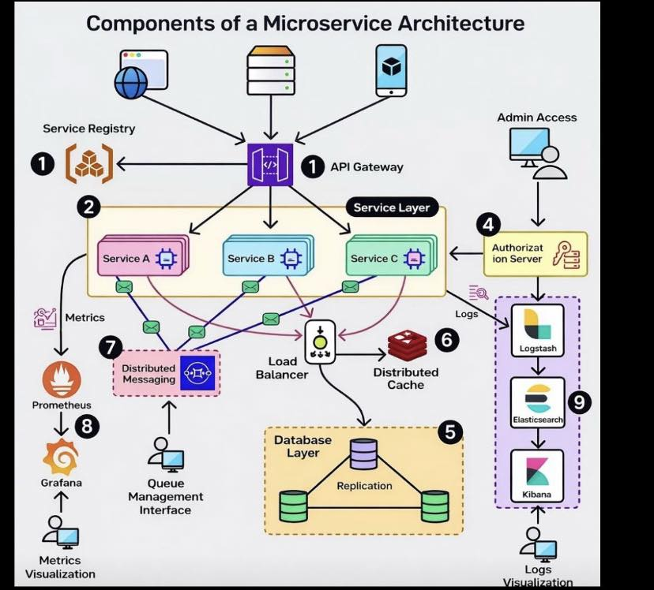
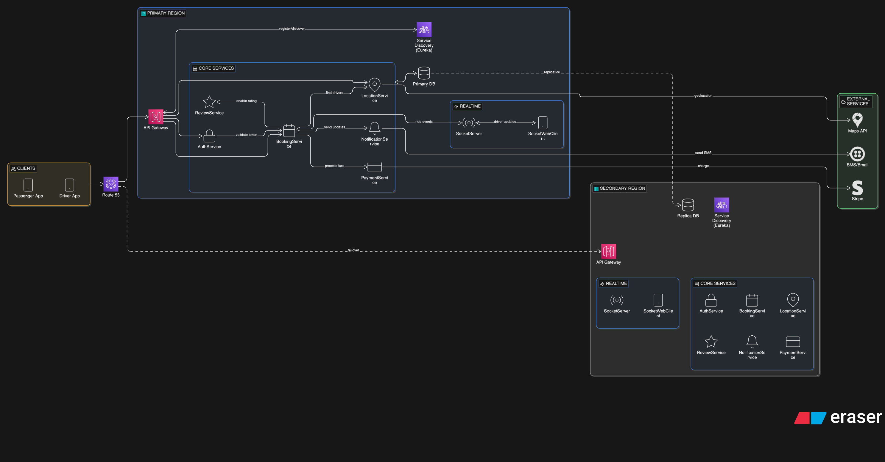

# ride-booking-platform
Ride Booking Platform – Microservice Architecture Java, Spring Boot, Kafka, Eureka, JWT, WebSocket
## Microservices Architecture

| Service         | Description                         | Repo Link |
|----------------|-------------------------------------|-----------|
| AuthService     | JWT-based authentication            | [Link](https://github.com/Adarshraj8/AuthService) |
| BookingService  | Handles booking flow                | [Link](https://github.com/Adarshraj8/BookingService) |
| LocationService | Returns nearby drivers              | [Link](https://github.com/Adarshraj8/LocationService) |
| ServiceDiscovery  |Acts as a central registry for all microservices| [Link](https://github.com/Adarshraj8/ServiceDiscovery) |
| EntityService   | Shared model/data library           | [Link](https://github.com/Adarshraj8/EntityService) |
| SocketServer   | WebSocket server for live updates     | [Link](https://github.com/Adarshraj8/SocketServer) |
| ReviewService| managing ratings and reviews between passengers and drivers| [Link](https://github.com/Adarshraj8/ReviewService) |
| UberNotificationService| The Uber Notification Service is responsible for handling all passenger notifications| [Link](https://github.com/Adarshraj8/UberNotificationService) |
|Uber-Gateway_Service| The Uber Gateway Service is a Spring Cloud Gateway–based microservice that serves as the API Gateway for the Uber clone system| [Link](https://github.com/Adarshraj8/Uber-Gateway_Service) |
|SocketWebClient|this file demonstrates real-time driver communication and ride request handling in a ride-hailing system using WebSockets, SockJS, and STOMP | [Link](https://github.com/Adarshraj8/SocketWebClient) |

Additional Project
Room Rental Service – A platform for listing and booking rental rooms. Built with Java, Spring Boot, and MySQL.
| Service         | Description                         | Repo Link |
|----------------|-------------------------------------|-----------|
| Room-RentalService| A platform for listing and booking rental rooms| [Link](https://github.com/Adarshraj8/room-rentalService) |
| room-rentalFrontend| A platform for listing and booking rental rooms| [Link](https://github.com/Adarshraj8/room-rentalFrontend) |

  

  

🚖 Uber Backend Microservices - Complete Architecture Analysis
📊 Project Overview
This is a production-ready Uber-like ride-hailing platform built with Spring Boot microservices architecture. It handles user authentication, ride booking, real-time location tracking, driver-passenger communication via WebSockets, and notifications.

🏗️ Architecture Components
Core Services (11 Microservices):
UberServiceDiscovery (Port: 8761)

Eureka Server for service registry
All services register here for discovery
uber-gateway-service (Port: 8081)

API Gateway with Spring Cloud Gateway
JWT authentication filter
Rate limiting with Redis
Circuit breaker (Resilience4j)
Routes all external requests to microservices
UberProject-AuthService (Port: 1001)

User authentication & authorization
JWT token generation
MySQL database for user data
Flyway for database migrations
UberBookingService (Port: 1005)

Handles ride booking creation & updates
MySQL database for bookings
Kafka consumer for ride updates
Retrofit client for inter-service communication
UberSocketServer (Port: 8080)

WebSocket server (STOMP protocol)
Real-time communication hub
Kafka producer/consumer
Handles ride requests, chat, notifications
UberProject-LocationService (Port: 1003)

Driver/passenger location tracking
Real-time location updates
ClientSocketService

WebSocket client service
Connects to UberSocketServer
UberNotificationService

Push notifications
Email/SMS alerts
UberReviewService

Ride ratings & reviews
UberProject-EntityService

Shared entity library
Common DTOs across services
SocketWebClient

HTML/JS client for testing WebSocket connections
Driver notification interface
🔄 Complete Application Flow
User Journey:
1. User Registration/Login
   → Client → Gateway (8081) → AuthService (1001)
   → JWT token returned

2. Request a Ride
   → Client → Gateway → BookingService (1005)
   → Creates booking in MySQL
   → Publishes to Kafka topic

3. Notify Nearby Drivers
   → Kafka → SocketServer (8080)
   → WebSocket broadcast to connected drivers
   → Driver receives ride request via /topic/rideRequest

4. Driver Accepts Ride
   → Driver sends acceptance via /app/rideResponse
   → SocketServer → Kafka → BookingService
   → Booking status updated

5. Real-time Tracking
   → LocationService (1003) tracks GPS
   → Updates broadcast via WebSocket
   → Both passenger & driver see live location

6. Ride Completion
   → BookingService updates status
   → NotificationService sends alerts
   → ReviewService enables rating
